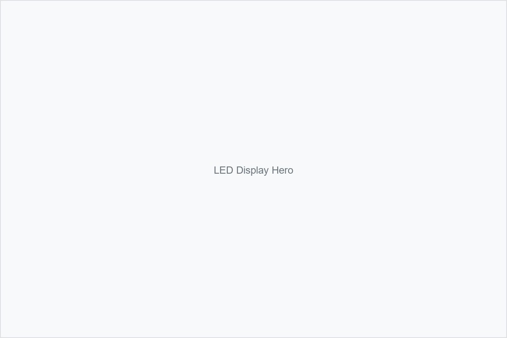

# 🖼️ 静态网站图片快速替换指南

## 🎉 恭喜！图片结构已创建完成

我已经为您创建了完整的图片文件结构，包含 **150张占位符图片** 和 **15个分类目录**。

## 📋 现在您可以这样操作：

### ✅ 第一步：查看已创建的图片
```
assets/
├── products/           # 产品图片 (34张)
├── cases/             # 案例图片 (21张)  
├── news/              # 新闻图片 (16张)
├── about/             # 关于我们 (13张)
├── solutions/         # 解决方案 (16张)
├── support/           # 技术支持 (16张)
├── contact/           # 联系我们 (9张)
├── logos/             # Logo文件 (3张)
├── icons/             # 图标文件 (9张)
├── certificates/      # 认证证书 (4张)
├── backgrounds/       # 背景图片 (4张)
└── banners/           # 横幅图片 (3张)
```

### ✅ 第二步：优先替换这些重要图片

#### 🔥 最高优先级（必须替换）
1. **`assets/products/led-display-hero.jpg`** - 主页横幅图片 (1200x800px)
2. **`assets/products/indoor-led-display.jpg`** - 室内LED显示屏 (800x600px)
3. **`assets/products/outdoor-led-display.jpg`** - 户外LED显示屏 (800x600px)
4. **`assets/products/rental-led-display.jpg`** - 租赁LED显示屏 (800x600px)
5. **`assets/products/transparent-led-display.jpg`** - 透明LED显示屏 (800x600px)
6. **`assets/products/creative-led-display.jpg`** - 创意LED显示屏 (800x600px)

#### 📈 中等优先级（建议替换）
- 各产品页面的主图（如 `fine-pitch-led-main.jpg`）
- 公司相关图片（如 `company-building.jpg`）
- 案例展示图片

#### 📊 低优先级（可选替换）
- 新闻图片
- 支持页面图片
- 背景装饰图片

## 🔧 替换方法

### 方法1：直接替换（推荐）
1. 准备您的图片文件
2. 重命名为对应的文件名（如 `led-display-hero.jpg`）
3. 直接覆盖 `assets/products/` 目录中的同名文件
4. 完成！网站会自动显示新图片

### 方法2：批量替换
1. 将您的所有产品图片放在一个文件夹中
2. 运行 `python replace_images.py`
3. 按提示选择源文件夹
4. 工具会自动复制图片到正确位置

## 📏 图片规格建议

| 图片类型 | 建议尺寸 | 文件大小 | 格式 |
|---------|---------|---------|------|
| 主页横幅 | 1200x800px | <500KB | JPG |
| 产品图片 | 800x600px | <300KB | JPG |
| 缩略图 | 400x300px | <200KB | JPG |
| Logo | 300x100px | <100KB | PNG |
| 图标 | 64x64px | <50KB | PNG |

## 🎯 快速开始（5分钟搞定）

如果您只想快速看到效果，只需替换这一张图片：

1. **准备一张您最好的LED显示屏产品图片**
2. **调整尺寸为 1200x800 像素**
3. **重命名为 `led-display-hero.jpg`**
4. **放入 `assets/products/` 文件夹**
5. **完成！** 打开网站就能看到您的图片

## 📂 文件路径对应关系

网站中的图片引用路径与实际文件位置完全对应：

```html
<!-- HTML中的引用 -->


<!-- 对应的文件位置 -->
项目根目录/assets/products/led-display-hero.jpg
```

## ⚠️ 重要提醒

1. **保持文件名不变** - 文件名必须与HTML中引用的完全一致
2. **注意文件格式** - 照片用JPG，透明图标用PNG
3. **控制文件大小** - 过大的图片会影响网站加载速度
4. **备份原文件** - 替换前建议备份原始占位符图片
5. **测试显示效果** - 替换后在浏览器中查看效果

## 🔍 查看完整图片列表

详细的图片列表和说明请查看：`assets/IMAGE_INDEX.md`

## 💡 小贴士

- **图片质量很重要** - 使用高质量的产品图片能大大提升网站专业度
- **保持风格一致** - 所有图片最好使用相似的色调和风格
- **优化加载速度** - 使用图片压缩工具减小文件大小
- **考虑移动端** - 确保图片在手机上也能清晰显示

## 🚀 完成后的效果

替换图片后，您的静态网站将：
- ✅ 显示真实的产品图片
- ✅ 提升专业形象和可信度
- ✅ 更好地展示产品特色
- ✅ 吸引更多潜在客户

---

**现在就开始替换您的第一张图片吧！** 🎨